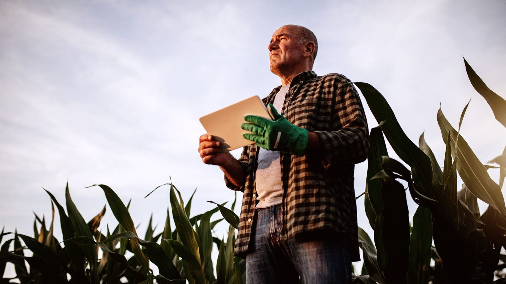

# 🌾 HortSoy - Conectando o Campo ao Futuro 🚀

Seja muito bem-vindo(a) ao repositório institucional da **HortSoy**, uma plataforma web moderna, premium e de alto desempenho desenvolvida para conectar produtores rurais às melhores tecnologias agrícolas, sementes de alta genética, fertilizantes e soluções sustentáveis para o agronegócio.



---

## 📌 Índice
- [🌳 Sobre o Projeto](#-sobre-o-projeto)
- [📁 Estrutura de Arquivos](#-estrutura-de-arquivos)
- [🖥️ Páginas do Site](#%EF%B8%8F-páginas-do-site)
- [⚙️ Funcionalidades Premium (UX/UI)](#%EF%B8%8F-funcionalidades-premium-uxui)
- [🛠️ Tecnologias Utilizadas](#%EF%B8%8F-tecnologias-utilizadas)
- [🚀 Como Executar o Projeto](#-como-executar-o-projeto)
- [👨‍💻 Mantenedores e Contato](#-mantenedores-e-contato)

---

## 🌳 Sobre o Projeto

A **HortSoy** atua como parceira estratégica do produtor rural, oferecendo insumos de altíssima qualidade e acompanhamento especializado. Este website foi construído para apresentar o portfólio de soluções, compartilhar notícias técnicas do campo e facilitar o contato direto com agrônomos especialistas.

O design do site reflete a sinergia entre **natureza e tecnologia** 🧪🌱 através de:
*   Cores em tons de verde folha e verde tecnológico (`#004b23`, `#38b000`) combinados com dourado solar (`#ffcc00`).
*   Tipografia elegante e moderna (fonte *Poppins* via Google Fonts).
*   Visual responsivo com animações suaves de entrada (Scroll Reveal) e carregamento fluido.

---

## 📁 Estrutura de Arquivos

O projeto possui uma arquitetura limpa e escalável para sites estáticos de alta performance:

```bash
Hortsoy/
│
├── 📂 assets/                     # Recursos visuais e mídias
│   └── 📂 img/                    # Logos, banners, favicon e fotos dos artigos
│
├── 📂 blog/                       # Artigos e notícias técnicas do agronegócio
│   ├── blog-barter-cafe.html      # Evento Barter Café 25/26 da Bayer
│   ├── blog-expo2025.html         # HortSoy na Expo 2025
│   ├── blog-manejo-soja.html      # Manejo de Soja com Nutrição (Vittia)
│   ├── blog-novo-centro.html      # Inauguração do Novo Centro Administrativo
│   ├── blog-plantando-ideias.html # Encontro Motivacional Plantando Ideias
│   └── blog-produtividade-bayer.html # Produtividade Agrícola com a Bayer
│
├── index.html                     # Página Inicial (Landing Page)
├── sobre.html                     # Nossa história e Radar HortSoy
├── servicos.html                  # Portfólio completo de Insumos e Consultoria
├── contato.html                   # Formulário de contato e canais de atendimento
│
├── style.css                      # Estilização global com Variáveis CSS e Grid
└── script.js                      # Dinamismo, Contadores, Slider Ken Burns e Scroll Effects
```

---

## 🖥️ Páginas do Site

O portal é composto por seções completas e intuitivas:

### 🏠 1. Home (`index.html`)
*   **Hero Section:** Apresentação impactante com slogan forte e chamadas para ação (CTA).
*   **Apresentação:** Seção sobre a empresa com slider dinâmico.
*   **Portfólio de Soluções:** Sementes, Fertilizantes e Defensivos.
*   **Estatísticas (Counters):** Métricas de sucesso (fazendas atendidas, colheitas, especialistas) que contam de forma animada até o número final ao entrar em tela.

### 🏢 2. Sobre Nós (`sobre.html`)
*   Explicação detalhada da história, valores e missão da HortSoy.
*   **Radar HortSoy:** Painel interativo de notícias do blog, mantendo o produtor sempre atualizado com as últimas inovações.

### 🚜 3. Serviços (`servicos.html`)
*   Detalhamento técnico das soluções da empresa, cobrindo o ciclo completo da lavoura (planejamento, plantio, nutrição, proteção e barter).

### 📞 4. Contato (`contato.html`)
*   Formulário moderno de atendimento.
*   Integração visual de contatos locais (Uberaba - MG) e redes sociais.

### ✍️ 5. Blog (`/blog`)
*   Artigos completos que cobrem desde parcerias estratégicas (Bayer, Vittia) até eventos do agronegócio e inovações em manejo sustentável.

---

## ⚙️ Funcionalidades Premium (UX/UI)

O site possui comportamentos visuais dignos de grandes portais de tecnologia:

1.  **Sticky Header Inteligente:** Ao rolar a página, o menu encolhe de forma fluida de `110px` para `80px` e ganha um fundo translúcido com efeito de desfoque de vidro (*backdrop-filter: blur*).
2.  **Slider Premium Ken Burns:** Na seção sobre a empresa, as imagens de plantações e tecnologia agrícola transitam através de um crossfade elegante acompanhado por uma sutil aproximação (efeito Ken Burns).
3.  **Scroll-Driven Animations:** Elementos surgem deslizando na tela de forma otimizada usando a API `IntersectionObserver` do JavaScript, evitando travamentos e melhorando a performance móvel.
4.  **Menu Mobile Responsivo:** Gaveta lateral inteligente acionada por um botão hambúrguer animado em CSS para telas pequenas.

---

## 🛠️ Tecnologias Utilizadas

*   **HTML5 Semântico:** Excelente estruturação SEO para melhor indexação no Google.
*   **CSS3 Moderno:** Utilização de Variáveis CSS (Custom Properties), Flexbox, CSS Grid e animações com transformações 3D.
*   **JavaScript ES6+:** Manipulação assíncrona do DOM baseada em eventos e observadores de interseção (`IntersectionObserver`).
*   **Fontes e Ícones:** Integração do Google Fonts (*Poppins*) e Font Awesome 6.

---

## 🚀 Como Executar o Projeto

Como o site é construído 100% em **HTML/CSS/JS nativos**, não é necessária nenhuma instalação complexa de dependências.

1.  Faça o clone ou baixe este repositório.
2.  Para uma melhor experiência de desenvolvimento, abra a pasta do projeto no **VS Code**.
3.  Instale a extensão **Live Server** no VS Code.
4.  Clique com o botão direito sobre o arquivo `index.html` e selecione **Open with Live Server**.
5.  O site será aberto automaticamente no seu navegador em `http://127.0.0.1:5500/`.

---

## 👨‍💻 Mantenedores e Contato

*   **📍 Localização:** Av. Santos Dumont, 130 - Uberaba, MG
*   **📞 Telefone:** (34) 99732-3304
*   **✉️ E-mail:** atendimento@hortsoy.com.br
*   **🌐 Site Oficial:** [hortsoy.com.br](https://hortsoy.com.br)
